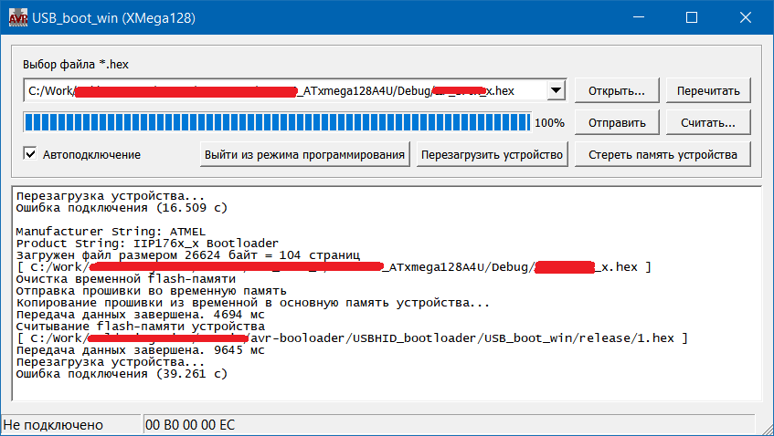
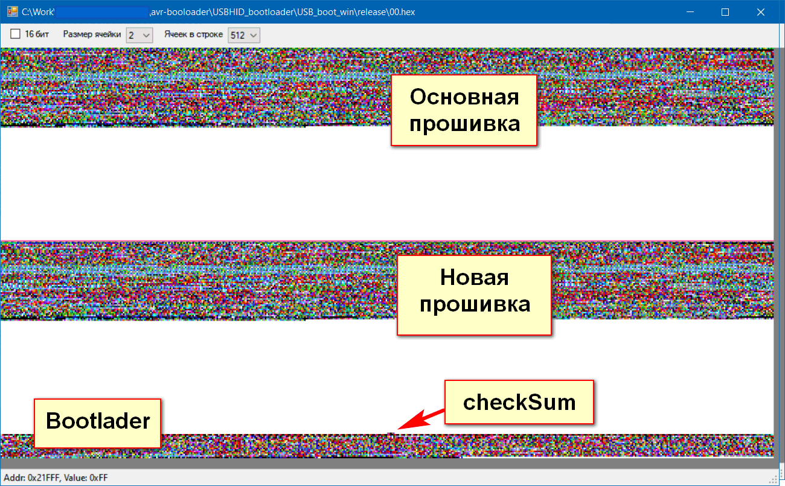

# Бутлоадер для загрузки прошивки через USB HID на ATxmega128a4u

Дополнение к программе, которые позволяет прошивать контроллер ATxmega128a4u через USB-HID. Задача поставлена 2020-11-25. 

 

Внешний вид клиентского приложения
 
## Hardware

Разработка проводится на плате некоего прибора с ATxmega128a4u.
Никаких переключателей на приборе не предусмотрено, есть кнопка сброса, светодиод состояния, разъем программирования и USB-порт.

## Алгоритм работы

Устройство подключается по USB к компьютеру, специальное клиентское приложение начинает загружать новую-прошивку. Новая прошивка записывается в свободную область - старшие адреса flash-памяти микрокнтроллера. При загрузке микрокнтроллера  программа-загрузчик проверяет, что новая-прошивка получена полностью и она действительно новая, затем копирует новую-прошивку на место основной программы. 

При включении микроконтроллера программа-загрузчик ожидает клиентское приложение 5 секунд, если не дождалось, или нет подключения по USB, то происходит запуск основной программы.  

## Распределение памяти

Микроконтроллер ATxmega128a4u имеет:

- 128 кБ flash-памяти под программу (0x0 - 0x1FFFF = 131071 Байт)
- 8 кБ flash-памяти под загрузчик (0x20000 - 0x21DFF = 7680 Байт)
- 2 кБ EEPROM
- 8 кБ SRAM - оперативной памяти

Основная программа обычно помещается в 30-40 кБ памяти.
Новая прошивка будет записываться в адреса 0x10000 (64кБайт от начала).
В последнюю страницу flash-памяти будут записываться данные о новой прошивке: 

- size [uint16]: размер новой прошивки в байтах; 
- crc [uint16]: контрольная сумма (например, CRC-16); 
- success [uint16]: флаг "успех" - устанавливается загрузчиком при успешной записи новой прошивки на место основной прошивки.

Доступ к памяти происходит постранично. Размер каждой страницы 256 Байт = 128 слов. Для записи 65536 байт надо 256 страниц. Если каждая страница за 4 HID-пакета (ограничение в 64 Байт), то потребуется больше тысячи отправок.



## Алгоритм записи flash-памяти

- Если USB подключено, то загрузчик ждет 5 секунды управляющих сигналов (report) по USB-HID от клиентского приложения. 
- Очистка второй половины flash-памяти. 
- Запись новой прошивки во вторую половину flash-памяти. 
- Загрузчик проходит всю память с новой прошивкой для подсчета контрольной суммы и сравнивает с контрольной суммой полученной от клиентского приложения. Если совпадает, то записывается. 
- Производится последовательное копирование новой прошивки на место старой прошивки
- После завершения копирования новой прошивки загрузчик проходит всю память основной прошивки для подсчета контрольной суммы и сравнивает с ячейкой контрольная_сумма. Если совпадает, то устанавливается ячейка успешная_запись.  

## USB-HID

Микроконтроллер ATxmega128a4u имеет поддержку подключения по USB. Для загрузчика будет использваться тип устройства Generic USB-HID, что позволит обойтись без дополнительных драйверов USB. Ограничение такого подхода в том, что нельзя передать больше 64 Байт данных в одном пакете при использовании стандартных драйверов операционной системы. Скорость обмена данных около 15-30 кБайт/с.   

## Заметки

Bootloader следует загружать после 0x20000. Для этого в настройке "XC8 Linker - Miscellaneous" следует указать
```-Wl,--relax -Wl,-Ttext=0x20000```  

Всего для загрузчика доступно почти 8 кБайт  
Этого хватает впритык на USB-HID + NVM + GPIO + CRC 

Для наглядного представления было создано приложение [simpleHexMap](https://github.com/fiskov/simpleHexMap)

